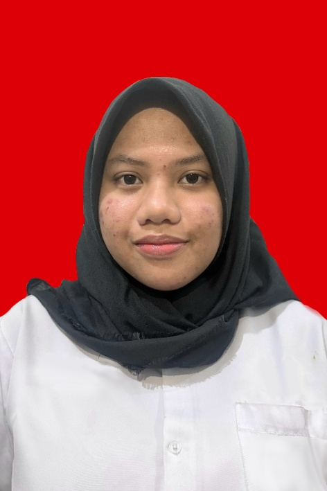

<html lang="id">
    
<head>
    <meta charset="UTF-8">
    <meta name="viewport" content="width=device-width, initial-scale=1.0">
    <title>CV - Dinda Ageng Syafrudin</title>
</head>
<body>
    

        <!-- HEADER -->
        <header>
            <h1>DINDA AGENG SYAFRUDIN</h1>
            

                

                    📱 +62 812-8266-7894
                

                

                    ✉️ <a href="mailto:dindasyafrudin@gmail.com">dindasyafrudin@gmail.com</a>
                

                

                    📍 Jakarta, Indonesia
                

            

        </header>
        <!-- PROFIL -->
        <section>
            <h2>PROFIL</h2>
            

                Lulusan dari SMA Negeri 10 Samarinda, jurusan MIPA. Kini menjadi mahasiswa aktif di jurusan Sistem Informasi, Telkom University Jakarta. Saya memiliki minat pada desain ilustrasi digital dan penulisan kreatif. Berpengalaman dalam kepanitiaan sekolah khususnya dalam bidang dekorasi dan konten digital, serta dikenal sebagai pribadi yang adaptif dan mampu bekerja sama dalam tim.
            

        </section>
        <!-- PENDIDIKAN -->
        <section>
            <h2>PENDIDIKAN</h2>           
            

                

                    Telkom University Jakarta
                    September 2025 – Sekarang
                

                
S1 Sistem Informasi

                <ul>
                    <li>IPK saat ini: 3,51 (skala 4,00)</li>
                </ul>
            

            

                

                    SMA Negeri 10 Samarinda
                    Juli 2022 – Februari 2025
                

                
Jurusan MIPA

                <ul>
                    <li>Rata-rata nilai rapor: 87,23</li>
                </ul>
            

        </section>
        <!-- PENGALAMAN & PROYEK -->
        <section>
            <h2>PENGALAMAN & PROYEK</h2>        
            

                

                    Perancangan Aplikasi "Evently" — Design Thinking
                

                <ul>
                    <li>Merancang UI/UX aplikasi Evently dengan menyusun tampilan dan alur penggunaan aplikasi berdasarkan kebutuhan pengguna.</li>
                    <li>Melaksanakan user testing untuk mengevaluasi pengalaman pengguna dan mengidentifikasi masukan untuk pengembangan aplikasi.</li>
                    <li>Menyusun laporan hasil user testing, sekaligus mengembangkan kemampuan dalam analisis kebutuhan pengguna, evaluasi desain, dan dokumentasi hasil pengujian.</li>
                </ul>
            

        </section>
        <!-- ORGANISASI & KEGIATAN -->
        <section>
            <h2>ORGANISASI & KEGIATAN</h2>         
            

                

                    Anggota — Kepanitiaan Dekorasi HUT Sekolah
                    Oktober 2022 – December 2023
                

                <ul>
                    <li>Berkontribusi dalam mempersiapkan dan menghasilkan dekorasi untuk mendukung pelaksanaan perayaan HUT sekolah.</li>
                </ul>
            

            

                

                    Sub-koordinator — Klub Seni Athravasa SMAN 10 Samarinda
                    Februari 2024 – Maret 2025
                

                <ul>
                    <li>Mengkoordinasikan anggota dan kegiatan di bidang seni tradisional.</li>
                </ul>
            

        </section>
        <!-- KETERAMPILAN -->
        <section>
            <h2>KETERAMPILAN</h2>
            

                
<strong>Hard Skills:</strong> Microsoft Office (Word, Excel, Powerpoint), Google Docs & Sheets, Desain Digital (Canva, Figma, IbisPaint X)

                
<strong>Soft Skills:</strong> Kerja Sama & Koordinasi Tim, Adaptif, Komunikasi, Manajemen Waktu, Bahasa Inggris (Intermediate)

            

        </section>
    

</body>
</html>
